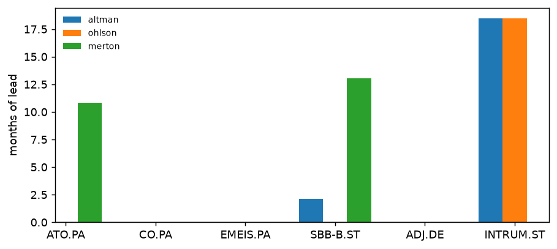

# credit-lab

Which default score flags first — Altman Z'', Ohlson O, or Merton distance-to-default —
measured against real European credit events, with the false-alarm count and the money
published on the same page.




**In short**

- Altman Z'', Ohlson O and Merton distance-to-default raced on six European court-supervised restructurings (2022–2024) and seven controls, strictly point-in-time.
- Published as a null result: with free statements starting in FY2022 only three of the six events are testable, and the three measured lead times are one per score, so they rank nothing.
- The one discriminating number is false alarms: Merton flags controls for 21.05 control-months, against about 10.6 for both accounting scores.

Rendered report: <https://emiliensabathier.github.io/credit-lab/>

## Results

Thirteen issuers: six that entered a court-supervised restructuring between 2022 and 2024,
seven that did not. A name is flagged when it sits among the three riskiest of the names
still alive and stays there for twenty sessions; a name leaves the ranking on its default
date. Statements are treated as public ninety days after fiscal year end.

**Lead time before the credit event, in months:**

| | Altman | Ohlson | Merton |
| --- | --- | --- | --- |
| Atos | **10.55** | ≥ 10.81 | ≥ 10.81 |
| Casino Guichard | no score | untestable | untestable |
| Emeis | untestable | untestable | untestable |
| Samhallsbyggnadsbolaget | ≥ 14.06 | **12.39** | ≥ 14.06 |
| Adler Group | untestable | untestable | untestable |
| Intrum | ≥ 18.50 | ≥ 18.50 | **7.13** |

- **untestable**: fewer than sixty sessions before the event on which the name carried a
  score inside a rankable cross-section. The score never had a chance to flag it, so this is
  a statement about the data, not about the score.
- **≥**: the alarm fired on the first date any alarm was possible (2023-05-02, the twentieth
  session after the cross-section became rankable). The true lead is at least this long and
  could be much longer; the number is a lower bound, not a measurement.
- **bold**: a measured lead — the alarm fired later than the first possible date.
- **no score**: Altman refuses Casino, whose filings do not report retained earnings.

**False alarms, in control-name months, counted up to the last credit event:**

| | Altman | Ohlson | Merton |
| --- | --- | --- | --- |
| false alarms | 10.67 | 10.52 | 21.05 |
| forced by the rule | 12.48 | 12.48 | 12.48 |

Full report with per-company charts, the event sources and the robustness grid:
[`reports/horserace.html`](reports/horserace.html).

## What this actually shows

Half the sample cannot be tested. The data source (Yahoo Finance via `yfinance`) carries
about four years of annual accounts: FY2022 onwards, with FY2021 all but empty. Under the
ninety-day lag the first usable statements are public on 2023-03-31, and the cross-section
becomes rankable that day. Emeis defaulted in April 2022 and Adler in April 2023, before or
days after that; Casino's May 2023 conciliation leaves 37 ranked sessions. None of the three
was missed by any score — none of the three could have been flagged by any score.

On the three names that can be tested — Atos, SBB, Intrum — every score flags every name in
time, under every convention in the robustness grid. That sounds strong and is mostly
structural: from Casino's default to Atos', exactly three stressed names are alive for three
slots, so any score that ranks them above the seven controls flags all three. Six
of the nine leads are censored at the first possible date; the three measured ones (10.55,
12.39, 7.13 months) are one per score, one per company, and rank nothing.

The false-alarm count is where the scores do differ. Once a stressed name defaults, fewer
than three are left and the rule hands the empty slots to controls whatever the score says:
12.48 control-months over the window are forced by arithmetic alone. Altman and Ohlson stay
at or below that floor (a forced slot that rotates between controls never persists twenty
sessions, which is how a count sits below it). Merton exceeds it by 8.57 months: it ranked
controls above live stressed names — Intrum chiefly, which Merton only flagged in April
2024. That is the one discriminating figure on this sample, and it is one score's behaviour
on a handful of names, not a test.

## What the lead was worth

A lead time on its own is a number that cannot be wrong. `avoided` is the signed return from
the alarm to the event: negative means the price fell after the alarm, which is what the
warning was worth. `already_suffered` is the fall from the prior twelve-month peak down to
the alarm, which is what the warning had already cost by the time it arrived.

| Ticker | Score | Alarm | Event | Lead | Censored | avoided | already_suffered | after_target |
| --- | --- | --- | --- | --- | --- | --- | --- | --- |
| ATO.PA | Altman | 2023-05-10 | 2024-03-26 | 10.55 | no | -0.86 | -0.53 | -0.61 |
| SBB-B.ST | Altman | 2023-05-02 | 2024-07-03 | 14.06 | yes | -0.14 | -0.57 | -0.21 |
| INTRUM.ST | Altman | 2023-05-02 | 2024-11-15 | 18.50 | yes | -0.62 | -0.63 | +0.18 |
| ATO.PA | Ohlson | 2023-05-02 | 2024-03-26 | 10.81 | yes | -0.86 | -0.53 | -0.61 |
| SBB-B.ST | Ohlson | 2023-06-22 | 2024-07-03 | 12.39 | no | **+1.24** | -0.81 | -0.21 |
| INTRUM.ST | Ohlson | 2023-05-02 | 2024-11-15 | 18.50 | yes | -0.62 | -0.63 | +0.18 |
| ATO.PA | Merton | 2023-05-02 | 2024-03-26 | 10.81 | yes | -0.86 | -0.53 | -0.61 |
| SBB-B.ST | Merton | 2023-05-02 | 2024-07-03 | 14.06 | yes | -0.14 | -0.57 | -0.21 |
| INTRUM.ST | Merton | 2024-04-12 | 2024-11-15 | 7.13 | no | **+0.34** | -0.79 | +0.18 |

Of the three measured alarms, only Altman on Atos preceded a fall (86%), and it arrived with
the stock already down 53% from its peak. Ohlson on SBB and Merton on Intrum fired at the
bottom: the shares then *rose* 124% and 34% to the event, after falls of 81% and 79%. Every
alarm that did precede a fall arrived with the name already down between 53% and 63%. On the
six censored rows the alarm date is the first date the test could start, so their
`already_suffered` is the fall that happened before the data allowed any alarm — not
evidence that the score was late, but no evidence that it was early either.

This is the column that turns "which score flags first" into "was any of it worth anything",
and on this sample the answer is: barely, and never demonstrably early.

## Robustness

Under every convention all three scores have the same three testable names and flag all
three in time. What varies is how many leads are censored and the measured lead that is
left — a single lead per cell, so the "median" is one observation:

| Variant | Altman | Ohlson | Merton |
| --- | --- | --- | --- |
| headline | 10.55 (2 of 3 censored) | 12.39 (2 of 3) | 7.13 (2 of 3) |
| lag 60 | 10.55 (2 of 3) | 12.39 (2 of 3) | 7.19 (2 of 3) |
| lag 120 | — (3 of 3) | 12.39 (2 of 3) | 7.13 (2 of 3) |
| persistence 10 | 11.04 (2 of 3) | 12.84 (2 of 3) | 7.65 (2 of 3) |
| persistence 40 | 9.63 (2 of 3) | 11.47 (2 of 3) | 6.11 (2 of 3) |
| tercile | — (3 of 3) | 13.80 (2 of 3) | 16.82 (2 of 3) |

Publication lag at 60, 90 and 120 days; persistence at 10, 20 and 40 sessions; the riskiest
three against the riskiest four. Censored leads are excluded from the median rather than
pooled with measurements. **No convention produces a ranking of the scores by lead time that
means anything, and this reads as a null result.**

## Method

- **Universe frozen before the first run.** `src/clab/universe.py` was committed before any
  score was computed, and no name has been added or removed since. That promise is only worth
  something because of the commit order, which is why it is stated here rather than asserted.
- **Events sourced one by one from primary documents.** No free data source publishes rating
  history. Each date is a court order, a company press release or an agency action, cited in
  `src/clab/events.py`. The rule is uniform: the date the first court-supervised proceeding
  became public; where none exists, the first SD/D rating. SBB is the only name taking the
  fallback.
- **Point-in-time by construction.** An annual report closed on 31 December is not available
  on 31 December. `pointintime.py` expands annual statements onto the daily index starting at
  publication date, ninety days after fiscal year end. The lag is uniform rather than
  per-company: a hand-collected set of real publication dates would be more accurate, but a
  uniform lag applied identically to every name and every year cannot favour one score over
  another, and that property matters more here than accuracy does.
- **The alarm is dated to the twentieth session, not the first.** An observer only knows on
  the twentieth session that the condition held. Dating it to the first would credit the score
  with information that did not exist yet — the same look-ahead the point-in-time layer spends
  its whole existence eliminating. The choice costs all three scores one month, equally.
- **The cross-section must be rankable before anything is flagged.** A date only counts once
  at least twice as many names carry a score as the number being flagged. Below that the rule
  stops selecting and starts describing whoever happens to have data.
- **Defaulted names leave the ranking.** A name already in default is not a forecast target;
  left in, it holds one of the riskiest slots for the rest of the window, delaying real alarms
  and hiding false ones. False alarms are counted only up to the last credit event, because
  after it the rule can only rank controls against each other.
- **Untestable is not missed, and a censored lead is not a measurement.** Each (score, event)
  pair is classified in `horserace.classify_lead` as measured, censored, missed or untestable,
  and the tables print the class rather than folding three of them into one blank.

## Reproducing the figures

The committed `reports/horserace.html` is rendered from a frozen fixture by
`scripts/build_frozen_report.py`, and a test asserts the committed page and the freshly
rendered one are identical outside the chart images.

Every figure above is pinned, by one of two routes, and the difference is worth stating
rather than blurring:

- the lead times with their status (measured, censored, missed, untestable, no score), the
  false-alarm counts, the forced floor and the common sub-sample are written out as literals
  in `tests/test_regression.py` and compared value by value;
- the impact and robustness tables are pinned by the report-identity test instead. They are
  not restated as literals anywhere, so they are protected only in the sense that changing
  them changes the rendered page, which then stops matching the committed one.

Either way a changed number fails the suite, and either way the cause is one of two
deliberate acts: the model changed, or the fixture was re-captured.

```bash
python -m pip install -e ".[dev]"
python -m pytest
python -m ruff check src tests
python -m clab --refresh      # live pull, writes reports/horserace.local.html
```

A live run never overwrites the committed report. It writes `horserace.local.html`, because
overwriting the committed page would silently break the identity test that makes it
trustworthy.

**The full suite is slow.** Four files — `test_pipeline`, `test_regression`, `test_report`,
`test_robustness` — replay the whole pipeline on the frozen or synthetic fixture, about a
minute and a half per replay on a laptop, and the robustness grid alone runs it six times
over; expect well over half an hour. The other sixty-nine tests (nine files) ran in 3.7
seconds on the same machine.

## Limitations

Stated because they matter more than the tables.

- **Six events are not a statistic, and only three can be tested.** Emeis, Adler and Casino
  default before the data holds sixty ranked sessions; on the remaining three, six of nine
  leads are lower bounds. This repository measures a handful of histories; it does not test
  a hypothesis, and no p-value appears anywhere in it.
- **About four years of accounts.** `yfinance` serves annual statements from FY2022 on;
  FY2021 is all but empty. A longer history (company filings, a paid vendor) is the single
  change that would turn untestable events into tests and lower bounds into measurements.
- **Selection bias, both ways.** The six events were chosen because they happened, and they
  are the European restructurings that made headlines; six of the seven controls are
  investment-grade blue chips (LVMH, SAP, Nestle...). Separating a famous default from a
  healthy blue chip is the easy version of the problem, and the stressed survivors that make it
  hard (names that came close and recovered) are absent apart from Aroundtown.
- **No point-in-time fundamentals.** The ninety-day lag fixes *when* a statement becomes
  usable, not *what* it said: Yahoo serves the latest restated figures, not the ones first
  published. A restatement after the fact leaks into every score built on accounts.
- **Casino has no Altman score at all**, because a statement line the formula needs is not
  reported in its filings as loaded. A missing line is not a zero and not a NaN to be filled
  later, so the score refuses; the refusal and its reason are published on the report page
  rather than quietly dropped.
- **Altman here is Z''**, the four-variable variant for non-manufacturers. The original Z is
  deliberately not used: its X4 divides market capitalisation by book liabilities, which
  would make the score move daily and destroy the one comparison the study exists to make —
  annual accounting against daily market data.
- **Ohlson's size term is on the wrong base.** Total assets are converted to US dollars at
  the rate of the day and divided by the US GNP price level, as Ohlson specifies, but on a
  2017=100 base rather than his 1968=100. That shifts every name's O by the same constant,
  which a rank rule ignores; it does not leave the textbook cut-off (O above zero, a
  probability above one half) meaningful, which is why that cut-off is kept as an internal
  control and never published as a result.
- **The fallen-angel cross-check is untestable.** Only Atos and SBB ever fell below BBB-, on
  2022-07-13 and 2023-05-08, both before the cross-section has sixty ranked sessions. It is
  kept on the report page so the gap stays visible, and is never averaged into the main
  table.
- **Merton is estimated from equity, not from debt prices.** Distance-to-default here is the
  standard structural inversion of equity value and volatility; it inherits every assumption
  in that, including a single debt point and lognormal asset dynamics.
- **Merton's share count lags.** Market capitalisation is price times the share count from
  the latest public annual balance sheet, so it can be up to fifteen months stale. For
  names that issued heavily in distress — rights issues, debt-for-equity swaps — equity
  value and therefore distance-to-default are mismeasured until the next annual report.

## Related

Four companion studies, same method: a frozen capture, a rendered report, and a
limitations section longer than the results.

- [rates-lab](https://github.com/emiliensabathier/rates-lab) — what the yield curve prices: policy path, inflation, term premium
- [valuation-lab](https://github.com/emiliensabathier/valuation-lab) — what a share price already assumes, by inverting a DCF
- [portfolio-lab](https://github.com/emiliensabathier/portfolio-lab) — whether any allocation rule beats a static 60/40
- [options-lab](https://github.com/emiliensabathier/options-lab) — what S&P 500 implied volatility prices: an arbitrage-free surface and the variance premium

## Licence

MIT.
